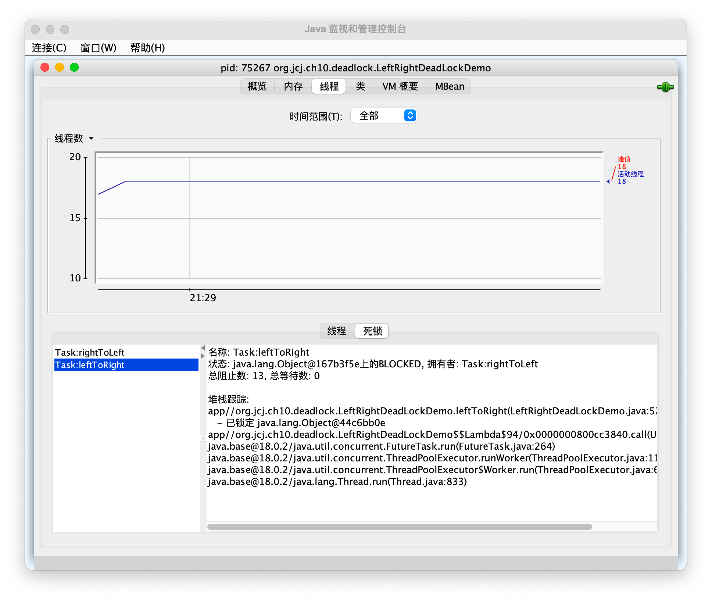
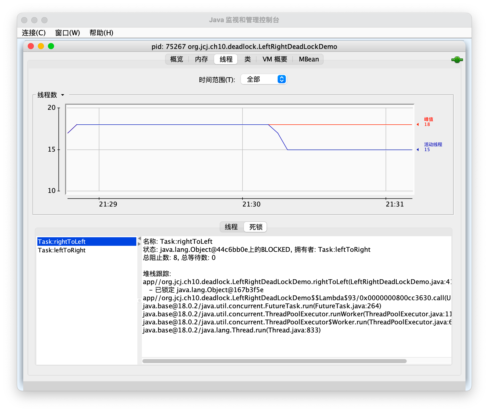

# DeadLock Test

## Test Source Code
[LeftRightDeadLockDemo.java](LeftRightDeadLockDemo.java)

## Test Result

Thread Dump

[threads_dump_report.txt](../../../../../resources/ch10resources/logs/threads_dump_report.txt)

.jpg)
.jpg)

jStack Log

[jstack.txt](../../../../../resources/ch10resources/logs/jstack.txt)

.jpg)
.jpg)
.jpg)

jConsole

